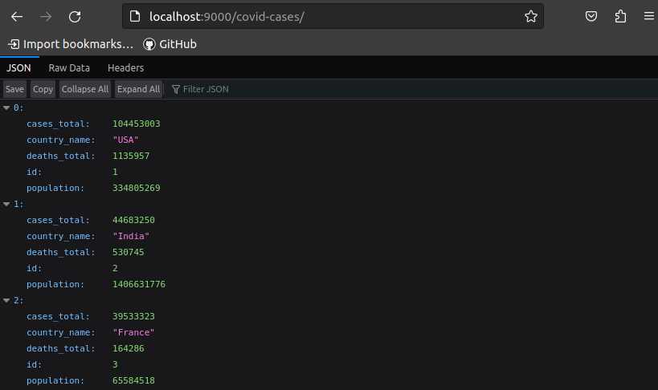

# Python Flask Project

## Description

The Python Flask Project is populated with data overviewing the impact of COVID in numerous countries.  This project is intended to illustrate CRUD capabilities utilizing Python, Peewee, and Flask.

- GitHub Link: https://github.com/Jagerziel/Python_Flask_Project
- API Root Directory: http://localhost:9000/api/
- The API is sourced from https://www.worldometers.info/coronavirus/#countries on 03 Feb 2023

## API Navigation

### ***Root API Screenshot***


### ***API All Data***



### ***API Data for Individual Country***


## Endpoints

To get started, navigate to the root path or insert one of the following paths into your browser:
1) Root Path:  http://localhost:9000/
2) All Countries: http://localhost:9000/covid-cases/
3) Country by ID: http://localhost:4000/covid-cases/:id/

## Technical Notes

### Data

### Dependencies

- cors
- dotenv
- express
- node-fetch
- nodemon
- morgan
- mongoose

## Data Cleansing

### Overview of Process

- Obtain Project IDs
- Write Project IDs to ProjectID File
- Use ProjectID File to dynamically pull individual projects
- Cleanse and model project data

### Obtaining/Writing the Project IDs

Fetch IDs from the API and write to JSON file.  Snippet of object output:
```
[{"projectId":116443,"lastUpdated":"2022-12-16"},{"projectId":94824,"lastUpdated":"2022-12-9"},...]
```
### Obtaining/Writing the Project Data
Use fetched IDs to write file of JSON objects.  The data needed to be cleansed as follows:
1) The output provides data in the following format - the first step is to go into the project object value:
```
{
    Project: {Object}
    ID: Number
}
```

2) After removing the first layer, the data was modeled to include only the following:
```
const dataNASA = new Schema({
    projectId: { type: Number },
    title: { type: String },
    benefits: { type: String },
    description: { type: String },
    destinations: [ { type: Object } ],
    startYear: { type: Number },
    startMonth: { type: Number },
    endYear: { type: Number },
    endMonth: { type: Number }
})

```
3) The NASA data in the subset pulled null values so of the 100 entries pulled, 80 were valid and should be kept.  This was filtered in the seed file:
```
const scrubbedData = data.filter((notNull)=>{
        return notNull !== null
    })
```
4) With the null entries removed, the next cleansing was conducted on the destinations.  The destinations is embedded as an array of objects.  In the seed file, each object is replaced with a smaller object only containing the desired fields:
```
    for (let j = 0; j < scrubbedData.length; j++) {
        const exists = 'destinations' in scrubbedData[j]
        if (exists) {
            scrubbedData[j].destinations = scrubbedData[j].destinations.map(item => {
                item = {
                    lkuCodeId : item.lkuCodeId,
                    description : item.description
                }
                return item
            })
        } 
    }
```

## Future Features

- User Authentication
- HTML Interface/Structured Data Output 
- Add writable project/entries for Future Projects

