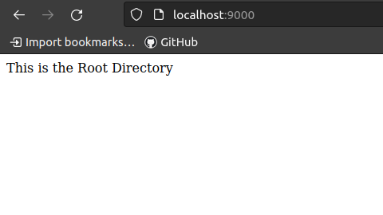

# Python Flask Project

## Description

The Python Flask Project is populated with data overviewing the impact of COVID in numerous countries.  This project is intended to illustrate CRUD capabilities utilizing Python, Peewee, and Flask.

- GitHub Link: https://github.com/Jagerziel/Python_Flask_Project
- API Root Directory: http://localhost:9000/api/
- The API is sourced from https://www.worldometers.info/coronavirus/#countries on 03 Feb 2023

## API Navigation

### ***Root API Screenshot***



### ***API All Data***


### ***API Data for Individual Country***


## Endpoints

To get started, navigate to the root path or insert one of the following paths into your browser:
1) Root Path:  http://localhost:9000/
2) All Countries: http://localhost:9000/covid-cases/
3) Country by ID: http://localhost:4000/covid-cases/:id/

## Technical Notes

### How to Run Program
In your terminal type:

1) `pipenv shell` 
2) `python3 lib/app.py`

### Data
Output is configured as follows:
```
{
  "cases_total": 104453003,
  "country_name": "USA",
  "deaths_total": 1135957,
  "id": 1,
  "population": 334805269
}
```

### Dependencies

- peewee
- flask

## Future Features

- Inclusion of API Key
- HTML Documentation
- Additional Entries
- Webscraping for Updated Data

